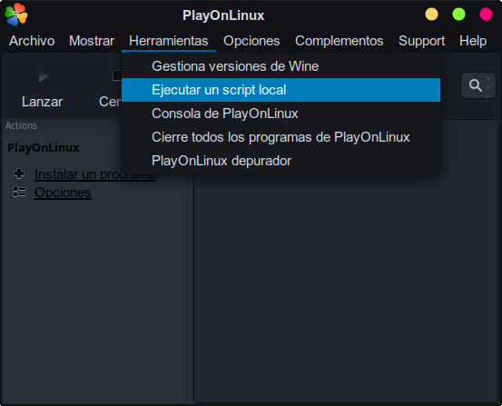
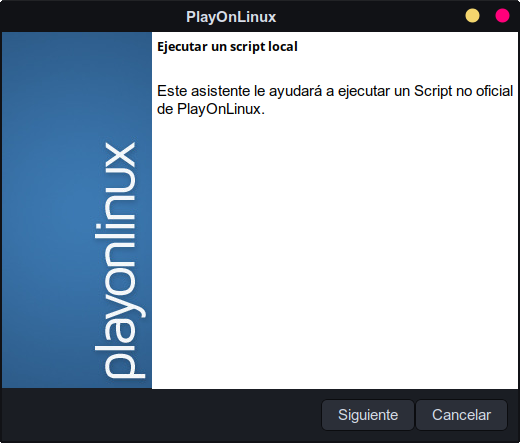
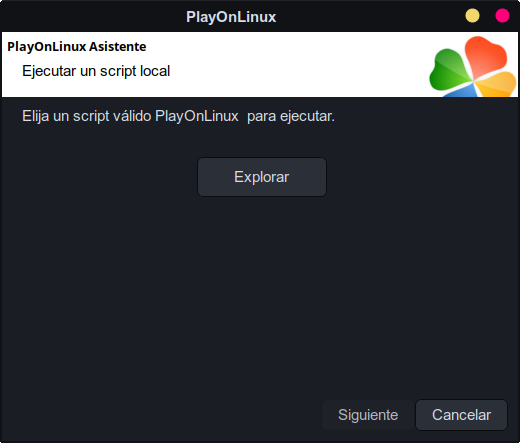
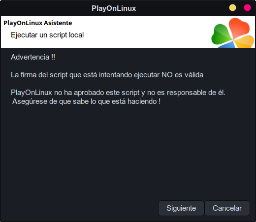
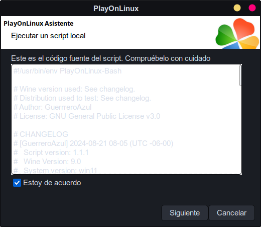
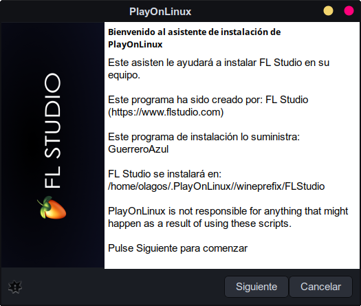

# FL Studio

## Introducción

**FL Studio** es un software de producción musical que permite crear, organizar, grabar, editar, mezclar y producir música profesional. Se trata de una estación de trabajo de audio digital (DAW, por sus siglas en inglés).

## Pasos de instalacion

1. Selecciona el menu de **Herramientas** >> **Ejecutar un script local**

   

2. Seleccionar el script de instalación:

   

3. Seguir los pasos de instalación

   

   

   

   

   
4. ¡Instalación Finalizada!

  > [!NOTE]
  > El banner y el icono es posible que no sean visible en tu instalación.
