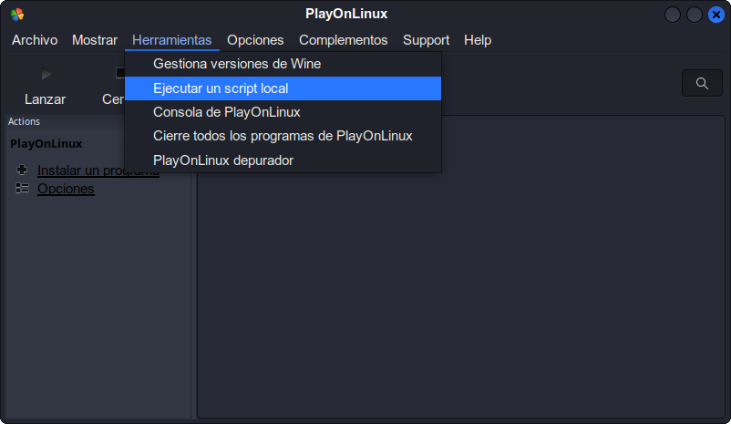
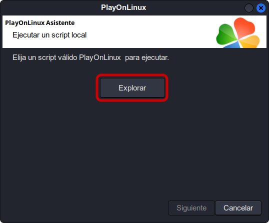
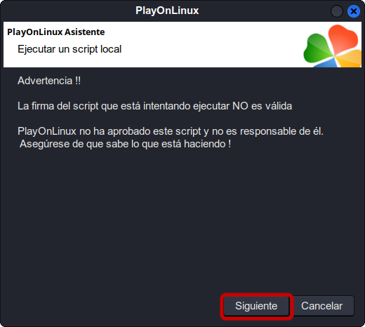
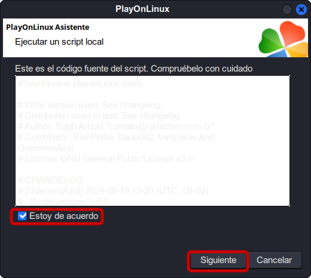
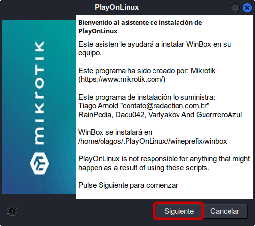
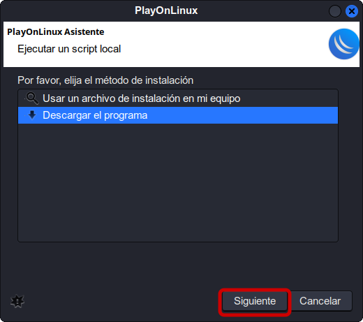
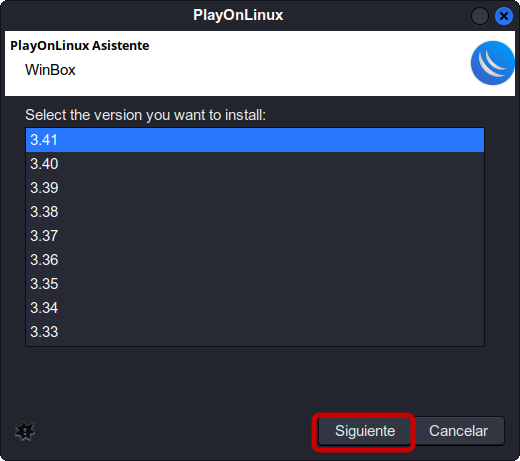
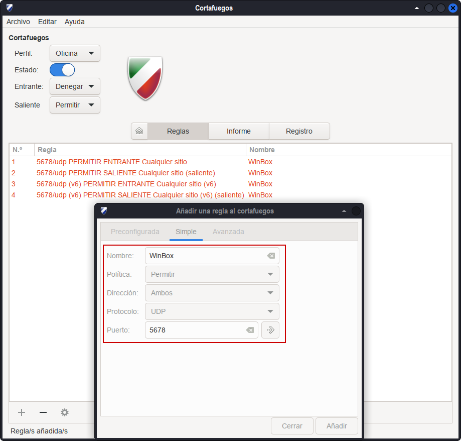
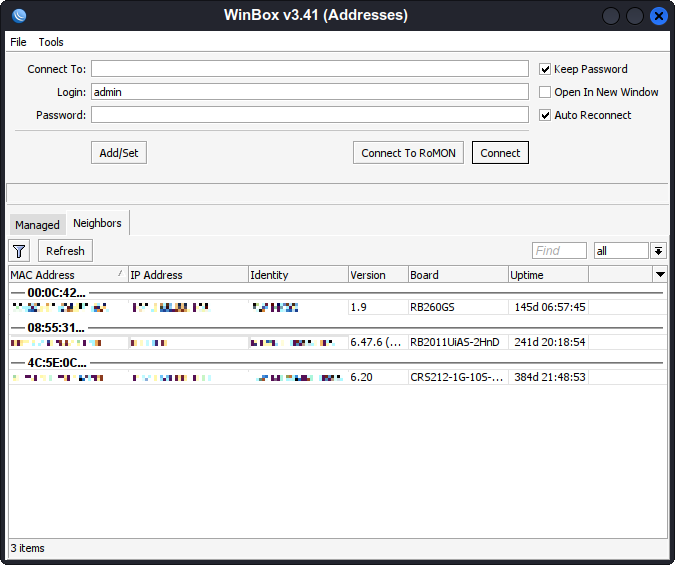
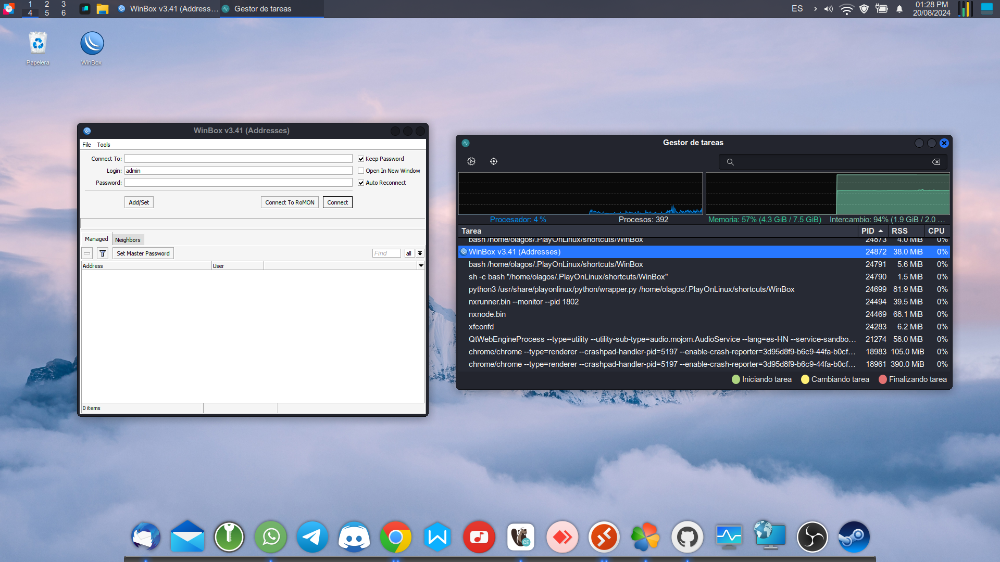

# Winbox


## Introducción

**Winbox** es una aplicación de Mikrotik RouterOS que permite administrar equipos mediante una interfaz gráfica. Esta aplicación permite administrar Mikrotik RouterOS de forma sencilla e intuitiva.

[](https://mikrotik.com/)
[](https://mikrotik.com/download)

## Pasos de instalacion

1. Selecciona el menu de **Herramientas** >> **Ejecutar un script local**

   

3. Seleccionar el script de instalación:

   

5. Seguir los pasos de instalación

   

   

   

   

   
7. ¡Instalación Finalizada!

> [!NOTE]
> El banner y el icono es posible que no sean visible en tu instalación.

> [!IMPORTANT]
> Si tienes el firewall activado, establece la siguiente regla:
> 
> 
>
> O a través de la terminal:
> ```
> sudo ufw allow proto udp from any to any port 5678 comment 'WinBox'
> ```

## Capturas





###### Referencia: [PlayOnLinux](https://www.playonlinux.com/en/app-3035-Winbox.html)
