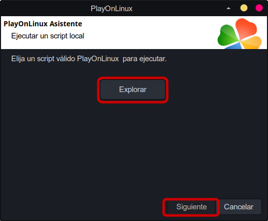
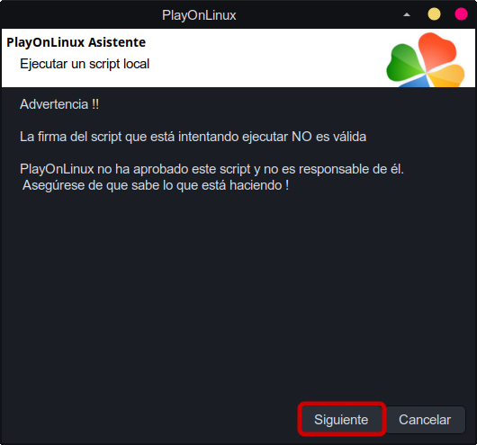
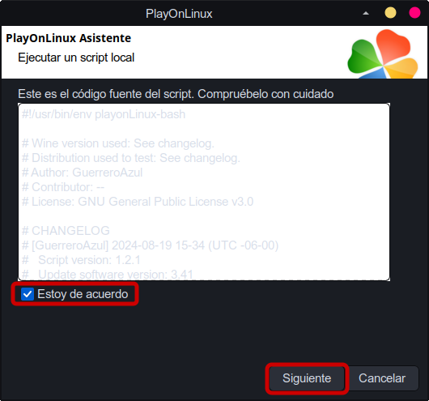
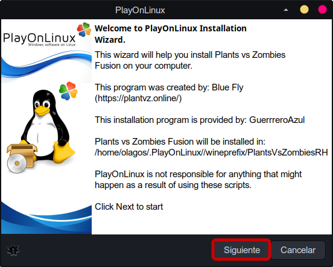
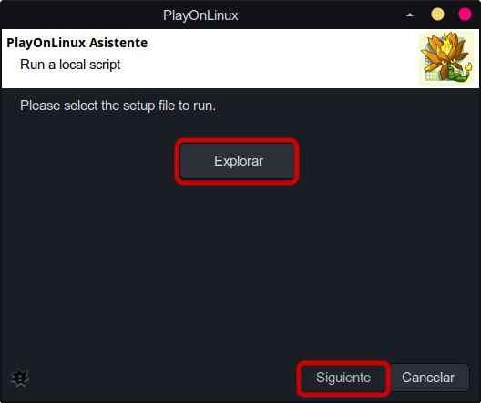
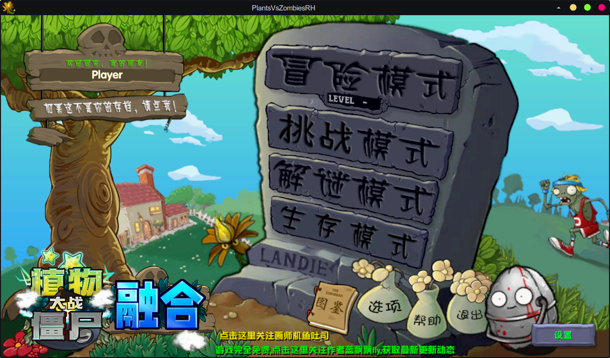
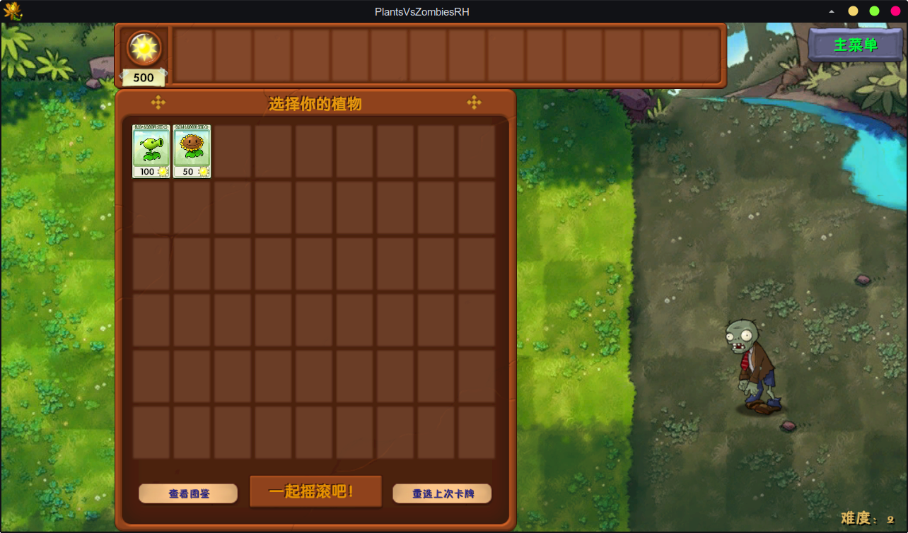

# Plants Vs Zombies Fusion

## Introducción

**Plants Vs Zombies Fusion**: el contexto sigue girando en torno a la batalla entre plantas y zombis, pero con un nuevo enfoque. Los jugadores participarán en batallas en un mundo en el que las plantas deben defender su hogar de la invasión zombi. Los personajes y los escenarios están diseñados con humor, con colores brillantes, manteniendo el estilo divertido de la serie.

## Pasos para la instalación

1. Selecciona el menu de **Herramientas** >> **Ejecutar un script local**

   

2. Seleccionar el script de instalación:

   

3. Seguir los pasos de instalación

   

   

   

   

4. ¡Instalación Finalizada!

## Capturas

###### Referencia: [PlayOnLinux](https://www.playonlinux.com/en/app-4591-Plants_Vs_Zombies.html)
