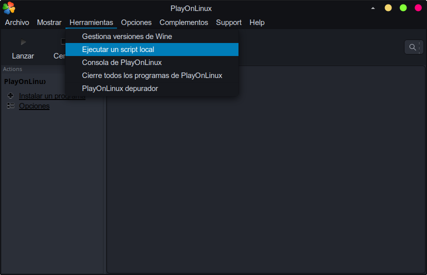
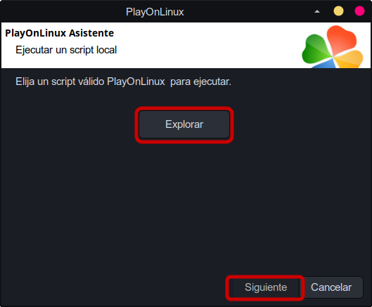
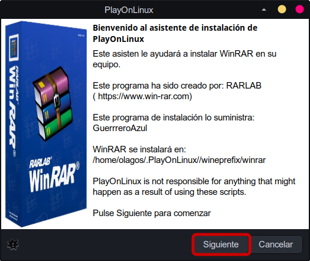
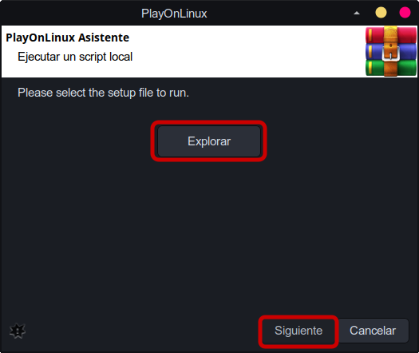
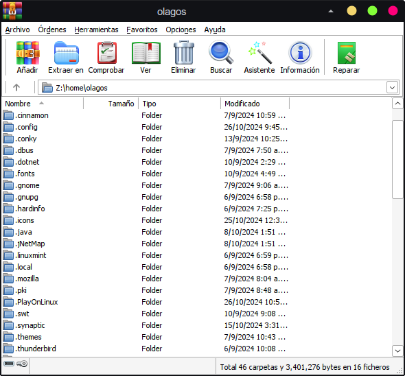
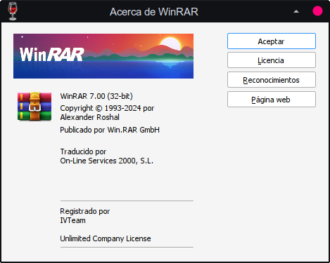

# WinRAR

## Introducción

**WinRAR** es un programa que permite abrir, comprimir, descomprimir y crear archivos comprimidos.

## Pasos para la instalación

1. Selecciona el menu de **Herramientas** >> **Ejecutar un script local**

   

2. Seleccionar el script de instalación:

   

3. Seguir los pasos de instalación

   

   

   

   

4. ¡Instalación Finalizada!

## Capturas

###### Referencia: [PlayOnLinux](https://www.playonlinux.com/en/app-4618-Winrar.html)
